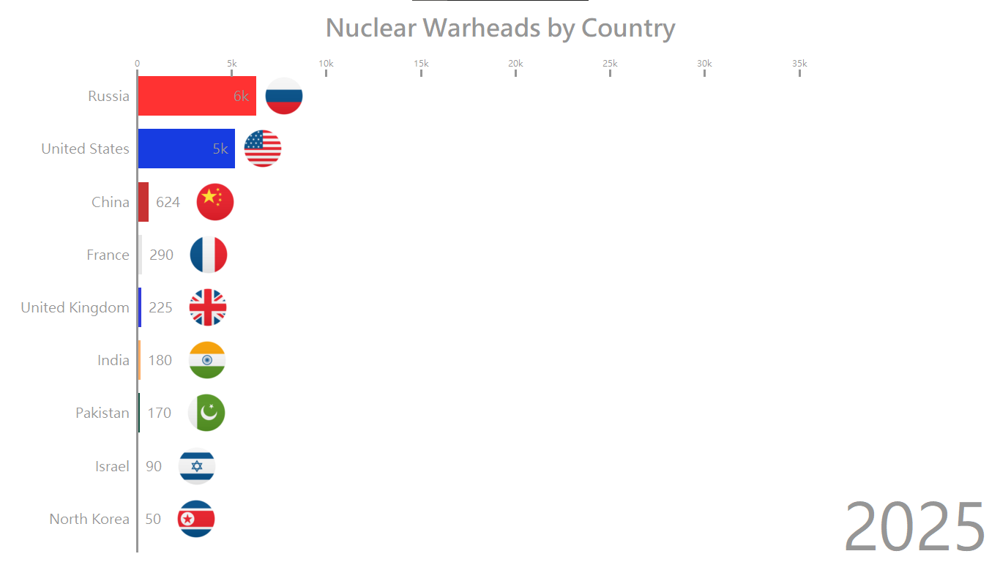
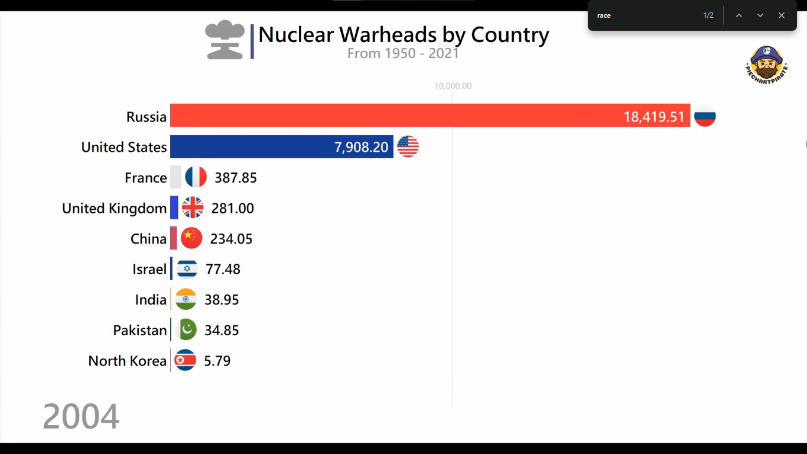

It aims to transform data, statistics, and information into engaging, high-quality videos and visuals. It specializes in animated data visualizations, particularly bar chart races, timelines, and infographics that present statistical information in a dynamic and easily digestible format. Example youtube channel : https://youtu.be/DSZGVqC42XI?feature=shared.

1. Collect Data : Get historical GDP datasets (e.g., World Bank, Maddison Project, IMF, Wikipedia, Kaggle).

2. Create Animated Charts
    
- Pros:
    - Full control, reproducible, automated (you can make 100s of videos easily), high quality, fast.
    - best for automating many videos quickly (e.g., daily/weekly content).
    - Free & open-source.
    - Libraries: bar_chart_race, matplotlib.animation, plotly, manim.
    - Use FFmpeg / MoviePy to add background music, title screens, and subtitles.
- Cons:
    - Visual polish is limited compared to pro tools.
    - Fonts, transitions, and effects require extra effort.
    - Looks a bit “scientific” unless you add editing.

    1. Python (Matplotlib + Pandas + Bar Chart Race). This directly outputs a video/MP4 of animated bars.
    
    ```python
    # using bar_chart_race
    # Install required libraries (only first time)
    # !pip install pandas bar_chart_race

    import pandas as pd
    import bar_chart_race as bcr

    # Load dataset (download from Kaggle and place in same folder)
    df = pd.read_csv("world_gdp.csv")

    # Inspect dataset
    print(df.head())

    # Example structure of dataset:
    # Country,1960,1961,1962,...,2022
    # India,37029838459,38610853377,...
    # USA,543300000000,563300000000,...

    # --- Data Preprocessing ---
    # Set Country as index
    df.set_index("Country", inplace=True)

    # Transpose so that years are rows, countries are columns
    df = df.T

    # Convert index (years) to int
    df.index = df.index.astype(int)

    # Keep only top N countries to avoid clutter
    top_countries = df.iloc[-1].sort_values(ascending=False).head(15).index
    df = df[top_countries]

    # Fill missing values
    df = df.fillna(0)

    # --- Generate Animation ---
    bcr.bar_chart_race(
        df=df,
        filename="gdp_race.mp4",       # Output file
        orientation='h',               # Horizontal bars
        sort='desc',                   # Largest at top
        n_bars=10,                     # Top 10 countries
        fixed_order=False,
        fixed_max=True,
        steps_per_period=20,
        interpolate_period=False,
        label_bars=True,
        bar_size=.95,
        period_label={'x': .95, 'y': .15, 'ha': 'right', 'va': 'center'},
        period_fmt='{x:.0f}',          # Show year as integer
        period_length=500,             # Speed of animation (ms per step)
        title='World GDP by Country (1960–2022)',
        bar_textposition='outside',
        figsize=(6, 3.5),
        dpi=300
    )
    ```

    ```python
    # using matplotlib.animation
    # pip install pandas matplotlib openpyxl
    # Install ffmpeg using sudo apt install ffmpeg
    import pandas as pd
    import matplotlib.pyplot as plt
    import matplotlib.animation as animation

    # Read Excel file
    df = pd.read_excel("nuclear.xlsx")

    # Ensure the first column is the year (index)
    df = df.set_index(df.columns[0])

    # List of countries (columns after the year)
    countries = df.columns.tolist()

    # Set up the figure
    fig, ax = plt.subplots(figsize=(10, 6))

    def update(year):
        ax.clear()
        values = df.loc[year].sort_values(ascending=True)
        ax.barh(values.index, values.values, color="skyblue")
        ax.set_title(f"Nuclear Warheads by Country - {year}", fontsize=16)
        ax.set_xlabel("Number of Nuclear Warheads")
        ax.set_xlim(0, df.max().max() * 1.1)  # scale to max value
        for i, (val, name) in enumerate(zip(values.values, values.index)):
            ax.text(val, i, str(val), va='center', ha='left', fontsize=9)

    # Create animation
    ani = animation.FuncAnimation(
        fig, update, frames=df.index, interval=1000, repeat=False
    )

    # Save animation as mp4 (requires ffmpeg installed)
    ani.save("nuclear_barchart_race.mp4", writer="ffmpeg", dpi=150)

    plt.show()
    ```
    
    2. Flourish (No-Code Tool). lets you upload your data and instantly create bar chart races. It has templates (like the exact GDP race style you saw). Exports as interactive embeds or MP4.
    
- Pros:
    - No coding, drag-and-drop.
    - Beautiful templates (exactly like Global Stats).
    - Fast production.
    - Good for beginners, but not ideal if you want automation + full creative control.
- Cons:
    - Free plan has watermark & no MP4 export (only interactive embeds).
    - Paid plan required for commercial use.
    - Less flexible than coding.

    3. After Effects / Adobe Premiere or DaVinci Resolve : More control but time-consuming. You import the data (CSV or JSON) and animate bars manually or with scripts.

- After Effects (AE) : A motion graphics software from Adobe. Think of it as Photoshop for video + animation. Used by professionals for:
    - Cinematic intros/outros
    - Text animations
    - Dynamic charts/infographics
    - Special effects
    - best for ultimate quality, but takes time to master.
    - Cons: Steep learning curve, paid ($20.99/month).

- Premiere Pro : A video editing application (timeline-based). Used for:
    - final editing of your animations + adding polish.
    - Cutting, trimming, joining clips
    - Adding music, transitions, subtitles
    - Color grading
    - It doesn’t make charts itself (you import animations from Python/AE/Flourish).
    - Easier than AE, but still professional-level. Paid.

3. Enhance with Editing : 
- Add background, background music, text overlays, narration, or country flags, transitions, logos.
- Use After Effects for advanced animations (flags, 3D effects).
- Tools: Adobe Premiere, DaVinci Resolve (free), or even CapCut.

4. Publish : Export as 1080p/4K MP4. Upload to YouTube/Instagram/TikTok. Optimize title, tags, and thumbnails for reach.

Learn more:
- https://youtu.be/cy26iRuZlAY?feature=shared
- https://youtu.be/lSnJk8z-ycE?feature=shared


# correction
- add time stamp dash - dash line instead of just one tick
- remove hard line at y axis.
- write full number instead of 10k.
- black color outside and inside white color correction.

